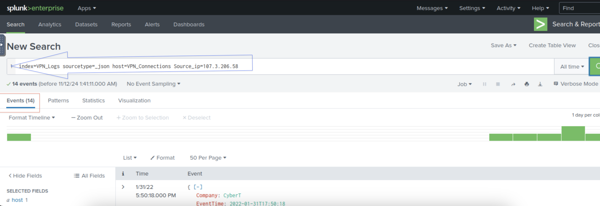

# Splunk-Basics

I completed the Splunk Basics course on TryHackMe, where I learned about key Splunk components such as the Forwarder, Indexer, and Search Head. I also gained hands-on experience navigating the Splunk GUI, adding data, and analyzing information to answer specific queries. Excited to continue building on this knowledge and explore more advanced features of Splunk.

## Task3 Correct Answer

## Task4 Correct Answer

## Task5 Creating Index

## Task5-1

## Task5-2

## Task5-3

## Task5-4

## Task5-5

## Task5 Correct Answer

## All Task Completed

